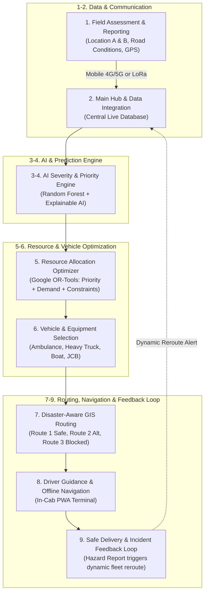

# AI Intelligent Accessibility in Disaster Logistics & Transportation

> **"Smarter Response. Safer Lives. In Disaster Situations."**  
> *From Field Reports to Optimized Resource Allocation, Adaptive Transportation, and Safe Delivery.*

### 🌐 [Live Interactive Web App (Click to Open)](https://kartikjalageri02-maker.github.io/AI-based-logistics-and-transportation-intelligence-/)

---

## 📌 Problem Overview & Solution Architecture

In sudden-onset disaster situations (floods, landslides, earthquakes), conventional supply chains break down due to severed communication, collapsed infrastructure, and severe resource scarcity. 

This project provides an end-to-end intelligent disaster logistics platform covering the **9 core pipeline stages** illustrated in the system architecture:



---

## 🚀 Key Modules & Capabilities

### 1. Field Assessment & LoRa Ingestion (Module 1 & 2)
- **Cellular & LoRa Dual-Mode**: In remote or flood-affected zones where cellular towers fail, officers transmit emergency telemetry via low-power **LoRa (Long Range, 868 MHz)** radios.
- Real-time ingestion of affected headcounts, road blockages, medical casualties, and GPS coordinates.

### 2. AI Severity & Prioritization Engine (Module 3 & 4)
- **Scikit-learn Random Forest Model & Explainable AI (XAI)**:
  - Factors: Affected civilian population, medical urgency (1–10), terrain hazard depth, and communication isolation penalty.
  - Outputs a calibrated **0–100 Severity Score** and assigns priority ranking (Location A: Critical vs Location B: Moderate).
  - Provides transparent human-readable explanations of why each location was prioritized.

### 3. Resource & Vehicle Allocation Optimizer (Module 5 & 6)
- **Constraint Optimization (Google OR-Tools Logic)**:
  - Solves the critical disaster bottleneck where demand exceeds supply (e.g. 4 ambulances requested across sites, only 3 available).
  - Prioritizes critical casualties first, while automatically triggering an **Alternative Support Plan** (e.g., deploying rugged 4x4 vehicles with telemedicine stabilization kits or air drops) for deferred sites.
- **Smart Vehicle & Equipment Matching**:
  - **Ambulances**: Medical emergency trauma cases.
  - **Heavy Trucks**: Large supply volumes (food rations & potable water).
  - **Rescue Boats**: Submerged / flooded terrain extraction.
  - **JCBs / Heavy Excavators**: Active landslide road clearance.
  - **4x4 Recon Vehicles**: Narrow mountain tracks.

### 4. Disaster-Aware GIS Routing & Dynamic Re-Routing (Module 7)
- Interactive **OpenStreetMap Leaflet GIS** visualization.
- **Route 1 (Primary - Safe Ridge)**: Green polyline, lowest risk corridor.
- **Route 2 (Alternative)**: Amber polyline, secondary bypass.
- **Route 3 (High Hazard / Blocked)**: Red dashed line, active landslide blockage.
- Animated GPS vehicle simulation showing live fleet transit.

### 5. Driver Offline PWA Terminal & Feedback Loop (Module 8 & 9)
- Simulates in-cab driver guidance with pre-cached offline map data.
- **Live Hazard Reporting**: When an en-route driver encounters a fallen boulder, bridge collapse, or flood surge, clicking *"Report Hazard"* transmits a high-priority packet back to the Main Hub.
- The Central Hub instantly marks the corridor as blocked and **dynamically recalculates routes** for all active dispatch units.

---

## 🛠️ Technology Stack

| Layer | Technologies |
|---|---|
| **Frontend & UI** | HTML5, Tailwind CSS, Leaflet GIS, FontAwesome 6, Web Audio API |
| **Backend & APIs** | Python 3.11 Standard Library HTTP server (`app.py`) + optional FastAPI (`api_fastapi.py`) |
| **AI & ML Engine** | Scikit-learn Random Forest model, Explainable AI (XAI) feature weights |
| **Optimization** | Google OR-Tools constraint satisfaction logic |
| **Mapping & GIS** | Leaflet.js, OpenStreetMap CartoDB DarkMatter tiles, polyline interpolation |
| **Remote Comms** | Simulated LoRaWAN gateway packet parser (868.1 MHz, RSSI/SNR metrics) |
| **Offline Tech** | PWA offline vector tile cache simulation |

---

## 💻 Quick Start & Running the Prototype

### Option 1: Zero-Dependency Mode (Works on Any Machine out-of-the-box)
This prototype comes with a self-contained Python 3.11 server that requires **no external pip packages**:

```powershell
# 1. Open terminal in the project directory
cd sih

# 2. Run the application
python app.py
```

Or on Windows, simply double click **`run.bat`**.

Now open your browser and navigate to:  
👉 **http://localhost:8000** (or `http://localhost:8000/index.html`)

---

### Option 2: FastAPI + Uvicorn Mode
If you prefer running with FastAPI and uvicorn:

```powershell
# Install dependencies
pip install -r requirements.txt

# Run FastAPI server
uvicorn api_fastapi:app --reload --port 8000
```

---

## 📁 Repository Structure

```
sih/
├── .gitignore              # Git ignore rules for Python, Node, OS files
├── README.md               # Complete architecture & documentation
├── run.bat                 # 1-click Windows launcher
├── app.py                  # Zero-dependency Python server & REST API
├── api_fastapi.py          # FastAPI backend alternative
├── requirements.txt        # Python dependencies
└── static/
    ├── index.html          # Emergency Command Center Operations UI
    ├── css/
    │   └── style.css       # Command Center tactical dark-theme styles
    └── js/
        ├── app.js          # App controller & Audio synthesizer
        ├── ai_engine.js    # AI Severity & Priority Engine
        ├── optimizer.js    # OR-Tools Resource & Vehicle allocation solver
        ├── map_routing.js  # Leaflet GIS routing & vehicle animation
        └── driver_sim.js   # Driver offline PWA navigation & feedback loop
```

---

## 🏆 Presentation & Live Demo Highlights
When presenting to evaluators or judges:
1. **Show GIS Navigation**: Point out Route 1 (Safe), Route 2 (Alternative), and Route 3 (Blocked Landslide) with the animated ambulance in transit.
2. **LoRa Remote Gateway**: Point out the LoRa terminal decoding packets from remote Chamoli with zero cellular coverage.
3. **AI Severity Scoring**: Open "+ New Field Report", add an urgent flood area, and watch the AI severity gauge instantly update and rank priorities.
4. **Scarcity Optimization**: Point out how the 3 available ambulances are optimally divided between locations, generating an automated alternative plan for the remainder.
5. **Interactive Feedback Loop**: In the Driver terminal, click **"Report Hazard"** — notice the audible alarm, the route updates to BLOCKED, and the hub dynamically reroutes the entire fleet!
